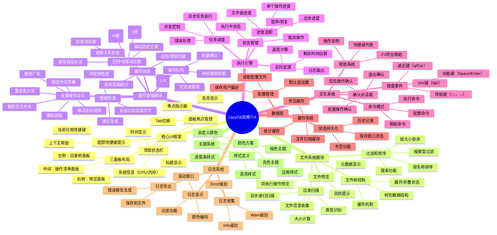

# LazyGit 风格 TUI 功能脑图与实施路线

## 📊 功能架构脑图（Mermaid）



---

## 🗺️ 文本版功能树

```
LazyGit 风格 TUI
│
├─── 1. 核心 UI 框架 ⭐⭐⭐⭐⭐ (优先级最高)
│    │
│    ├─── 1.1 布局系统
│    │    ├─ 三面板分割（30% - 40% - 30%）
│    │    ├─ 响应式布局（根据终端大小调整）
│    │    ├─ 面板最小尺寸限制
│    │    └─ 全屏模式切换
│    │
│    ├─── 1.2 顶部状态栏
│    │    ├─ 应用标题和版本
│    │    ├─ 当前目录路径
│    │    ├─ 系统资源监控（可选）
│    │    └─ 当前时间
│    │
│    ├─── 1.3 底部快捷键栏
│    │    ├─ 上下文相关提示
│    │    ├─ 当前面板可用操作
│    │    └─ 通用快捷键（帮助/退出）
│    │
│    └─── 1.4 面板焦点管理
│         ├─ Tab 循环切换面板
│         ├─ 焦点视觉指示器（边框颜色）
│         ├─ 鼠标点击切换（可选）
│         └─ 快捷键直接跳转（1/2/3）
│
├─── 2. 左侧面板：目录树 ⭐⭐⭐⭐⭐
│    │
│    ├─── 2.1 文件系统扫描
│    │    ├─ 异步递归目录遍历
│    │    ├─ 文件信息收集（大小/修改时间/类型）
│    │    ├─ 符号链接处理
│    │    ├─ 权限检查
│    │    └─ 进度反馈（扫描大目录时）
│    │
│    ├─── 2.2 树形结构渲染
│    │    ├─ 文件夹图标（📁 📂）
│    │    ├─ 文件类型图标（🎬 📄 🗑️）
│    │    ├─ 缩进和连接线（├─ └─）
│    │    ├─ 展开/折叠指示器（▶ ▼）
│    │    └─ 选中项高亮
│    │
│    ├─── 2.3 导航功能
│    │    ├─ ↑↓/jk 上下移动
│    │    ├─ Enter/→/l 展开文件夹
│    │    ├─ Backspace/←/h 折叠/返回上级
│    │    ├─ g/G 跳转到顶部/底部
│    │    ├─ Page Up/Down 翻页
│    │    └─ / 搜索功能
│    │
│    ├─── 2.4 统计信息显示
│    │    ├─ 总文件夹数量
│    │    ├─ 总文件数量
│    │    ├─ 总大小（格式化显示）
│    │    ├─ 选中项统计
│    │    └─ 待处理项标记
│    │
│    └─── 2.5 智能标记
│         ├─ 将被删除的项（红色）
│         ├─ 将被移动的项（黄色）
│         ├─ 将被重命名的项（蓝色）
│         ├─ 有问题的项（⚠️ 标记）
│         └─ 已处理的项（✓ 标记）
│
├─── 3. 中间面板：操作清单 ⭐⭐⭐⭐⭐
│    │
│    ├─── 3.1 操作项定义
│    │    ├─ 操作 1: 删除空文件夹
│    │    │   ├─ 复选框状态
│    │    │   ├─ 描述文本
│    │    │   ├─ 影响范围（将删除 X 个）
│    │    │   └─ 释放空间估算
│    │    │
│    │    ├─ 操作 2: 移动中文字幕视频
│    │    │   ├─ 匹配规则显示（-C, -ch）
│    │    │   ├─ 找到文件数量
│    │    │   ├─ 目标路径
│    │    │   └─ 冲突警告
│    │    │
│    │    ├─ 操作 3: 移动无码视频
│    │    ├─ 操作 4: 重命名为大写
│    │    ├─ 操作 5: 删除文件名前缀
│    │    ├─ 操作 6: 删除广告文件
│    │    │
│    │    └─ 操作 7: 🆕 手动移动单个文件/文件夹
│    │        ├─ 在目录树中选中文件
│    │        ├─ 按 m 键进入移动模式
│    │        ├─ 快速目标选择
│    │        │   ├─ [1] CHINESE/
│    │        │   ├─ [2] UNCENSORED/
│    │        │   ├─ [3] 最近使用的目录
│    │        │   └─ [4] 自定义路径...
│    │        ├─ 目标目录浏览器
│    │        │   ├─ 可导航的目录树
│    │        │   ├─ Tab 补全路径
│    │        │   └─ 新建目录选项
│    │        ├─ 移动预览
│    │        │   ├─ 源路径 → 目标路径
│    │        │   ├─ 冲突检测
│    │        │   └─ 覆盖确认
│    │        └─ 批量手动移动
│    │            ├─ v 进入多选模式
│    │            ├─ 选中多个文件
│    │            └─ 统一移动到目标
│    │
│    ├─── 3.2 交互功能
│    │    ├─ Space 切换操作启用/禁用
│    │    ├─ ↑↓ 选择不同操作
│    │    ├─ Enter 查看操作详情
│    │    ├─ a 全选/全不选
│    │    ├─ i 反选
│    │    └─ ? 显示操作帮助
│    │
│    ├─── 3.3 智能分析
│    │    ├─ 实时扫描匹配文件
│    │    ├─ 依赖关系检查
│    │    │   └─ 例：移动操作需要先创建目录
│    │    ├─ 冲突检测
│    │    │   ├─ 文件名冲突
│    │    │   ├─ 路径冲突
│    │    │   └─ 磁盘空间不足
│    │    └─ 建议生成
│    │        ├─ 推荐启用的操作
│    │        └─ 风险警告
│    │
│    └─── 3.4 配置选项
│         ├─ c 打开配置对话框
│         │   ├─ 输出目录设置
│         │   ├─ 自定义前缀列表
│         │   └─ 自定义广告模式
│         ├─ 保存为预设
│         └─ 加载预设
│
├─── 4. 右侧面板：预览 ⭐⭐⭐⭐
│    │
│    ├─── 4.1 文件详情预览
│    │    ├─ 文件路径
│    │    ├─ 文件大小
│    │    ├─ 修改时间
│    │    ├─ 文件类型
│    │    ├─ 权限信息
│    │    └─ 哈希值（可选）
│    │
│    ├─── 4.2 操作影响预览
│    │    ├─ 当前状态 → 变更后状态
│    │    ├─ 箭头指示变化
│    │    ├─ 颜色编码
│    │    │   ├─ 绿色：新增/安全
│    │    │   ├─ 黄色：修改/警告
│    │    │   └─ 红色：删除/危险
│    │    └─ 变化摘要
│    │
│    ├─── 4.3 批量预览
│    │    ├─ 显示前 N 个受影响文件
│    │    ├─ "...还有 X 个文件"
│    │    ├─ 统计信息汇总
│    │    └─ 滚动查看更多
│    │
│    └─── 4.4 风险提示
│         ├─ ⚠️ 不可逆操作警告
│         ├─ 💾 需要备份提示
│         ├─ ⚡ 大量文件警告
│         └─ 🔍 建议预览再执行
│
├─── 5. 执行模式（全屏切换）⭐⭐⭐⭐⭐
│    │
│    ├─── 5.1 进度显示系统
│    │    ├─ 总体进度条
│    │    │   ├─ 百分比显示
│    │    │   ├─ 已完成/总数
│    │    │   ├─ 可视化进度条
│    │    │   └─ 颜色渐变
│    │    │
│    │    ├─ 当前操作进度
│    │    │   ├─ 操作名称
│    │    │   ├─ 当前文件
│    │    │   ├─ 文件级进度
│    │    │   └─ 子进度条
│    │    │
│    │    └─ 速度和时间估算
│    │        ├─ 已用时间
│    │        ├─ 剩余时间
│    │        ├─ 处理速度（文件/秒）
│    │        └─ 数据传输速度（MB/秒）
│    │
│    ├─── 5.2 实时日志窗口
│    │    ├─ 滚动日志输出
│    │    ├─ 颜色编码
│    │    │   ├─ 绿色：成功
│    │    │   ├─ 黄色：警告
│    │    │   ├─ 红色：错误
│    │    │   └─ 灰色：调试
│    │    ├─ 时间戳
│    │    ├─ 日志级别标记
│    │    ├─ 自动滚动（可关闭）
│    │    └─ 日志过滤
│    │        ├─ 只显示错误
│    │        ├─ 只显示警告
│    │        └─ 搜索日志
│    │
│    ├─── 5.3 统计面板
│    │    ├─ 实时统计
│    │    │   ├─ 已处理文件数
│    │    │   ├─ 已移动文件数
│    │    │   ├─ 已删除文件数
│    │    │   ├─ 已重命名文件数
│    │    │   ├─ 跳过文件数
│    │    │   └─ 错误数量
│    │    │
│    │    └─ 资源使用
│    │        ├─ CPU 使用率
│    │        ├─ 内存使用
│    │        ├─ 磁盘 I/O
│    │        └─ 网络（如果适用）
│    │
│    └─── 5.4 控制功能
│         ├─ Ctrl+C 停止处理
│         ├─ Space 暂停/恢复
│         ├─ s 跳过当前文件
│         ├─ ↑↓ 滚动日志
│         └─ q 取消（需要确认）
│
├─── 5.5 🆕 手动移动模式（弹出层）⭐⭐⭐⭐
│    │
│    │    ┌─────────────────────────────────────────────────────────┐
│    │    │ 📦 手动移动文件                           [Esc]取消    │
│    │    ├─────────────────────────────────────────────────────────┤
│    │    │ 源文件: /test/SSIS-001/video.mp4                       │
│    │    │ 大小: 1.2 GB                                           │
│    │    ├─────────────────────────────────────────────────────────┤
│    │    │ 🎯 选择目标目录:                                        │
│    │    │                                                         │
│    │    │   [1] 📁 CHINESE/          (中文字幕)                  │
│    │    │   [2] 📁 UNCENSORED/       (无码)                      │
│    │    │   [3] 📁 ~/Downloads/      (最近使用)                  │
│    │    │   [4] 📁 自定义路径...                                  │
│    │    │                                                         │
│    │    │ ─────────────────────────────────────────────────────   │
│    │    │ 或输入路径: /output/OTHER/_                             │
│    │    │             [Tab补全] [↑↓历史]                         │
│    │    ├─────────────────────────────────────────────────────────┤
│    │    │ 预览: /test/SSIS-001/video.mp4                         │
│    │    │    → /output/OTHER/SSIS-001/video.mp4                  │
│    │    │                                                         │
│    │    │ ✓ 目标目录存在                                         │
│    │    │ ✓ 无文件冲突                                           │
│    │    ├─────────────────────────────────────────────────────────┤
│    │    │      [Enter] 确认移动    [n] 新建目录    [Esc] 取消    │
│    │    └─────────────────────────────────────────────────────────┘
│    │
│    ├─── 5.5.1 快速移动（数字键直达）
│    │    ├─ 选中文件后按 m
│    │    ├─ 按 1 直接移到 CHINESE/
│    │    ├─ 按 2 直接移到 UNCENSORED/
│    │    └─ 按 3-9 移到最近使用目录
│    │
│    ├─── 5.5.2 目录浏览器模式
│    │    ├─ 按 4 或 / 进入浏览模式
│    │    ├─ ↑↓ 浏览目录
│    │    ├─ Enter 进入子目录
│    │    ├─ Backspace 返回上级
│    │    ├─ Tab 路径自动补全
│    │    └─ n 新建目录
│    │
│    ├─── 5.5.3 批量移动模式
│    │    ├─ 在目录树按 v 进入多选
│    │    ├─ ↑↓ + Space 选择多个文件
│    │    ├─ 按 m 打开移动对话框
│    │    ├─ 显示选中文件列表
│    │    │   ├─ "已选择 5 个文件"
│    │    │   ├─ "总大小: 4.5 GB"
│    │    │   └─ [展开查看详情]
│    │    └─ 统一移动到同一目标
│    │
│    └─── 5.5.4 移动历史记录
│         ├─ 记录最近 10 次移动目标
│         ├─ 按 r 查看历史
│         ├─ 快速重复上次操作
│         └─ 支持撤销（如可能）
│
├─── 6. 交互系统 ⭐⭐⭐⭐
│    │
│    ├─── 6.1 键盘事件处理
│    │    ├─ 导航键
│    │    │   ├─ ↑↓←→ 方向键
│    │    │   ├─ hjkl Vim 风格
│    │    │   ├─ Page Up/Down
│    │    │   └─ Home/End
│    │    │
│    │    ├─ 功能键
│    │    │   ├─ Space 切换/选择
│    │    │   ├─ Enter 确认/执行
│    │    │   ├─ Esc 取消/返回
│    │    │   ├─ Backspace 返回
│    │    │   ├─ Delete 删除
│    │    │   ├─ m 🆕 手动移动选中项
│    │    │   └─ v 🆕 多选模式
│    │    │
│    │    ├─ 快捷键
│    │    │   ├─ Tab 切换面板
│    │    │   ├─ 1/2/3 跳转面板
│    │    │   ├─ q 退出
│    │    │   ├─ h/? 帮助
│    │    │   ├─ c 配置
│    │    │   ├─ / 搜索
│    │    │   └─ : 命令模式
│    │    │
│    │    └─ 组合键
│    │        ├─ Ctrl+C 中断
│    │        ├─ Ctrl+R 刷新
│    │        ├─ Ctrl+S 保存
│    │        └─ Ctrl+Z 撤销（如可能）
│    │
│    ├─── 6.2 对话框系统
│    │    ├─ 确认对话框
│    │    │   ├─ 执行前确认
│    │    │   ├─ 危险操作确认
│    │    │   ├─ 退出确认（有未保存）
│    │    │   └─ 覆盖文件确认
│    │    │
│    │    ├─ 输入对话框
│    │    │   ├─ 路径输入
│    │    │   ├─ 搜索输入
│    │    │   ├─ 配置输入
│    │    │   └─ 自动补全
│    │    │
│    │    ├─ 选择对话框
│    │    │   ├─ 单选列表
│    │    │   ├─ 多选列表
│    │    │   └─ 下拉菜单
│    │    │
│    │    └─ 信息对话框
│    │        ├─ 错误提示
│    │        ├─ 警告提示
│    │        ├─ 成功提示
│    │        └─ 帮助信息
│    │
│    └─── 6.3 帮助系统
│         ├─ F1/h/? 呼出帮助
│         ├─ 分类快捷键列表
│         │   ├─ 导航操作
│         │   ├─ 文件操作
│         │   ├─ 面板操作
│         │   └─ 系统操作
│         ├─ 操作说明
│         ├─ 滚动查看
│         └─ 搜索帮助内容
│
├─── 7. 配置管理 ⭐⭐⭐
│    │
│    ├─── 7.1 配置文件
│    │    ├─ 默认配置路径
│    │    │   ├─ ~/.config/rust-jav/config.toml
│    │    │   └─ ./rust-jav.toml
│    │    ├─ 配置结构
│    │    │   ├─ [paths] 路径配置
│    │    │   ├─ [operations] 操作配置
│    │    │   ├─ [ui] 界面配置
│    │    │   └─ [advanced] 高级选项
│    │    └─ 配置验证
│    │
│    ├─── 7.2 用户偏好
│    │    ├─ 默认启用的操作
│    │    ├─ 快捷键映射
│    │    ├─ 主题选择
│    │    ├─ 日志级别
│    │    └─ 自动保存设置
│    │
│    ├─── 7.3 预设管理
│    │    ├─ 保存当前配置为预设
│    │    ├─ 加载预设
│    │    ├─ 预设列表
│    │    └─ 删除预设
│    │
│    └─── 7.4 运行时配置
│         ├─ c 打开配置界面
│         ├─ 实时修改生效
│         ├─ 重置为默认值
│         └─ 导入/导出配置
│
├─── 8. 日志系统 ⭐⭐⭐⭐
│    │
│    ├─── 8.1 日志收集
│    │    ├─ 分级日志
│    │    │   ├─ TRACE 跟踪
│    │    │   ├─ DEBUG 调试
│    │    │   ├─ INFO 信息
│    │    │   ├─ WARN 警告
│    │    │   └─ ERROR 错误
│    │    ├─ 结构化日志
│    │    │   ├─ 时间戳
│    │    │   ├─ 级别
│    │    │   ├─ 模块
│    │    │   ├─ 消息
│    │    │   └─ 上下文
│    │    └─ 性能日志
│    │        ├─ 操作耗时
│    │        └─ 资源使用
│    │
│    ├─── 8.2 日志显示
│    │    ├─ TUI 内日志窗口
│    │    ├─ 颜色编码
│    │    ├─ 图标标记
│    │    ├─ 自动滚动
│    │    ├─ 手动滚动（暂停自动）
│    │    └─ 日志搜索
│    │
│    ├─── 8.3 日志过滤
│    │    ├─ 按级别过滤
│    │    ├─ 按模块过滤
│    │    ├─ 按关键词过滤
│    │    └─ 正则表达式过滤
│    │
│    └─── 8.4 日志导出
│         ├─ 保存到文件
│         ├─ 日志轮转
│         ├─ 压缩归档
│         └─ 错误报告生成
│
├─── 9. 主题系统 ⭐⭐⭐
│    │
│    ├─── 9.1 预设主题
│    │    ├─ 暗色主题（默认）
│    │    ├─ 亮色主题
│    │    ├─ 高对比度主题
│    │    └─ 无障碍主题
│    │
│    ├─── 9.2 颜色方案
│    │    ├─ 主色调
│    │    ├─ 强调色
│    │    ├─ 警告色
│    │    ├─ 错误色
│    │    ├─ 成功色
│    │    └─ 背景/前景色
│    │
│    ├─── 9.3 样式定义
│    │    ├─ 边框样式
│    │    │   ├─ 实线
│    │    │   ├─ 虚线
│    │    │   ├─ 双线
│    │    │   └─ 圆角
│    │    ├─ 高亮样式
│    │    │   ├─ 背景色
│    │    │   ├─ 粗体
│    │    │   ├─ 斜体
│    │    │   └─ 下划线
│    │    └─ 进度条样式
│    │        ├─ 字符集
│    │        ├─ 颜色渐变
│    │        └─ 动画效果
│    │
│    └─── 9.4 自定义主题
│         ├─ 主题配置文件
│         ├─ 实时预览
│         ├─ 导入/导出主题
│         └─ 社区主题库
│
└─── 10. 错误处理与恢复 ⭐⭐⭐⭐
     │
     ├─── 10.1 错误类型
     │    ├─ 文件系统错误
     │    │   ├─ 权限不足
     │    │   ├─ 文件不存在
     │    │   ├─ 磁盘已满
     │    │   └─ 路径过长
     │    ├─ 操作错误
     │    │   ├─ 文件占用
     │    │   ├─ 目标已存在
     │    │   └─ 循环依赖
     │    └─ 系统错误
     │        ├─ 内存不足
     │        └─ 终端不支持
     │
     ├─── 10.2 错误处理策略
     │    ├─ 继续（跳过错误项）
     │    ├─ 重试（可配置次数）
     │    ├─ 中止（停止所有操作）
     │    └─ 询问（让用户决定）
     │
     ├─── 10.3 错误显示
     │    ├─ 错误对话框
     │    ├─ 错误日志
     │    ├─ 错误汇总
     │    └─ 错误导出
     │
     └─── 10.4 恢复机制
          ├─ 操作日志记录
          ├─ 检查点保存
          ├─ 回滚功能（如可能）
          └─ 断点续传
```

---

## 🚀 实施路线图（MVP → 完整版）

### 第一阶段：MVP（3-4天）核心功能 ✅

```
Day 1: 基础框架
├─ ✅ 搭建 Ratatui + Crossterm 项目结构
├─ ✅ 实现三面板布局
├─ ✅ 实现面板焦点切换（Tab）
├─ ✅ 基础键盘事件处理
└─ ✅ 顶部状态栏 + 底部快捷键栏

Day 2: 核心面板 - 左侧目录树
├─ ✅ 同步目录扫描
├─ ✅ 简单列表显示（无树形结构）
├─ ✅ 上下导航（↑↓）
└─ ✅ 基础文件信息显示

Day 3: 核心面板 - 中间操作清单
├─ ✅ 6 个操作项定义
├─ ✅ 复选框切换（Space）
├─ ✅ 简单影响统计
└─ ✅ Enter 执行功能

Day 4: 执行引擎 + 测试
├─ ✅ 同步执行操作
├─ ✅ 简单进度条
├─ ✅ 基础日志输出
└─ ✅ 端到端测试

MVP 产出:
✅ 可用的三面板 TUI
✅ 基本文件浏览
✅ 6 个核心操作
✅ 简单执行反馈
```

### 第二阶段：增强功能（3-4天）

```
Day 5: 文件树优化
├─ ✅ 树形结构显示
├─ ✅ 展开/折叠功能
├─ ✅ 文件类型图标
└─ ✅ 搜索功能（/）

Day 6: 🆕 手动移动功能
├─ ✅ 移动对话框界面
├─ ✅ 快速目标选择（数字键）
├─ ✅ 目录浏览器模式
├─ ✅ 路径输入 + Tab 补全
├─ ✅ 移动预览 + 冲突检测
└─ ✅ v 键多选模式

Day 7: 预览面板 + 智能检测
├─ ✅ 右侧预览面板实现
├─ ✅ 文件详情显示
├─ ✅ 操作影响预览
└─ ✅ 智能建议系统

Day 8: 执行优化
├─ ✅ 异步执行（tokio）
├─ ✅ 双进度条（总体 + 当前）
├─ ✅ 实时日志滚动窗口
└─ ✅ 速度和时间估算
```

### 第三阶段：完善体验（2天）

```
Day 9: 交互优化
├─ ✅ 确认对话框
├─ ✅ 帮助系统（F1）
├─ ✅ 配置界面（c）
├─ ✅ Vim 风格快捷键
└─ ✅ 错误处理对话框

Day 10: 主题 + 配置
├─ ✅ 暗色/亮色主题
├─ ✅ 配置文件读写
├─ ✅ 用户偏好保存
└─ ✅ 性能优化
```

### 第四阶段：高级功能（可选，1-2天）

```
Day 11-12: 锦上添花
├─ ⚡ 日志导出功能
├─ ⚡ 操作历史记录
├─ ⚡ 断点续传
├─ ⚡ 批量预设管理
├─ ⚡ 统计图表
├─ ⚡ 自定义主题编辑器
├─ ⚡ 🆕 移动历史记录（最近10次）
├─ ⚡ 🆕 移动撤销功能
└─ ⚡ 🆕 快捷目录书签管理
```

---

## 📊 功能优先级矩阵

| 功能模块 | 优先级 | 复杂度 | 用户价值 | 实施时间 |
|---------|-------|--------|---------|---------|
| 三面板布局 | P0 ⭐⭐⭐⭐⭐ | 低 | 高 | 0.5天 |
| 目录扫描 | P0 ⭐⭐⭐⭐⭐ | 中 | 高 | 0.5天 |
| 操作清单 | P0 ⭐⭐⭐⭐⭐ | 低 | 高 | 0.5天 |
| 执行引擎 | P0 ⭐⭐⭐⭐⭐ | 高 | 高 | 1天 |
| 键盘导航 | P0 ⭐⭐⭐⭐⭐ | 低 | 高 | 0.5天 |
| 树形结构 | P1 ⭐⭐⭐⭐ | 中 | 中 | 0.5天 |
| 预览面板 | P1 ⭐⭐⭐⭐ | 中 | 中 | 0.5天 |
| 进度显示 | P1 ⭐⭐⭐⭐ | 中 | 高 | 0.5天 |
| 日志系统 | P1 ⭐⭐⭐⭐ | 中 | 中 | 0.5天 |
| 确认对话框 | P1 ⭐⭐⭐⭐ | 低 | 高 | 0.3天 |
| 🆕 **手动移动** | **P1** ⭐⭐⭐⭐ | 中 | **高** | **0.5天** |
| 🆕 批量多选 | P1 ⭐⭐⭐⭐ | 中 | 高 | 0.3天 |
| 帮助系统 | P2 ⭐⭐⭐ | 低 | 中 | 0.3天 |
| 搜索功能 | P2 ⭐⭐⭐ | 中 | 中 | 0.5天 |
| 配置管理 | P2 ⭐⭐⭐ | 中 | 低 | 0.5天 |
| 🆕 路径自动补全 | P2 ⭐⭐⭐ | 中 | 中 | 0.3天 |
| 🆕 移动历史记录 | P3 ⭐⭐ | 低 | 中 | 0.2天 |
| 主题系统 | P3 ⭐⭐ | 低 | 低 | 0.5天 |
| 智能建议 | P3 ⭐⭐ | 高 | 中 | 1天 |
| 统计图表 | P4 ⭐ | 中 | 低 | 1天 |

---

## 🎯 关键技术实现点

### 1. 异步文件扫描（高优先级）

```rust
use tokio::fs;
use async_recursion::async_recursion;

#[async_recursion]
async fn scan_directory(path: PathBuf) -> Result<FileTree> {
    let mut entries = fs::read_dir(&path).await?;
    let mut tree = FileTree::new(path);

    while let Some(entry) = entries.next_entry().await? {
        let metadata = entry.metadata().await?;

        if metadata.is_dir() {
            let subtree = scan_directory(entry.path()).await?;
            tree.add_child(subtree);
        } else {
            tree.add_file(entry.path(), metadata);
        }
    }

    Ok(tree)
}
```

### 2. 响应式布局系统

```rust
fn calculate_layout(terminal_size: Rect) -> Rc<[Rect]> {
    Layout::default()
        .direction(Direction::Vertical)
        .constraints([
            Constraint::Length(1),              // 顶部
            Constraint::Min(20),                // 主体
            Constraint::Length(2),              // 底部
        ])
        .split(terminal_size)
}
```

### 3. 事件驱动架构

```rust
enum AppEvent {
    KeyPress(KeyEvent),
    FileScanned(FileInfo),
    OperationProgress(usize, usize),
    OperationComplete,
    Error(String),
}

async fn event_loop(mut app: App) {
    let (tx, mut rx) = mpsc::channel(100);

    loop {
        tokio::select! {
            Some(event) = rx.recv() => {
                match event {
                    AppEvent::KeyPress(key) => handle_key(&mut app, key),
                    AppEvent::FileScanned(file) => app.add_file(file),
                    // ...
                }
            }
            _ = tokio::time::sleep(Duration::from_millis(16)) => {
                // 60 FPS 渲染
                terminal.draw(|f| ui(f, &app))?;
            }
        }
    }
}
```

---

## 📝 下一步行动

1. **确认需求**：这个功能清单是否符合您的预期？
2. **开始 MVP**：我可以为您生成完整的 MVP 代码框架
3. **迭代开发**：逐步添加增强功能

您想要我：
- A) 生成完整的 MVP 代码（Day 1-4 的实现）
- B) 先实现某个特定模块的详细代码
- C) 调整功能清单

请告诉我您的选择！🚀
