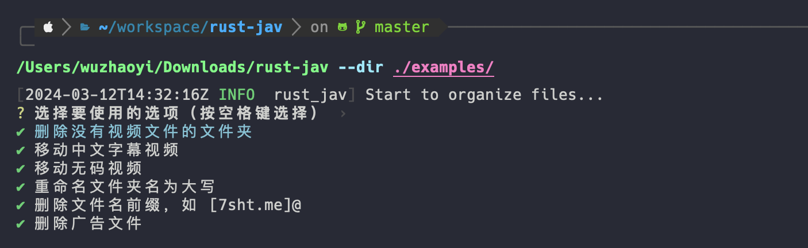

# Rust Jav

为 jav torrent 编写的一些小工具，用于整理 jav torrent 文件夹，可以搭配 [MetaTube](https://metatube-community.github.io/) 使用。

当前版本采用 **CLI-first / AI-friendly** 设计：

- 先把能力沉淀为清晰的 CLI 命令
- 所有文件类操作默认 **preview**
- 只有显式传入 `--apply` 才会真正改动文件系统
- TUI 是这套能力的交互界面，而不是另一套独立语义

## 预览



## 功能

- 使用 rust 编写，tokio 异步，速度快
- 删除 jav torrent 中的无用文件，如 楼风最全资源\*
- 重命名 jav torrent 中的文件，如 hhd800.com@SSIS-001.mp4 -> SSIS-001.mp4
- 文件夹名重命名，如 ssis-001 -> SSIS-001
- 根据后缀整理文件，如 `-C` `ch` 结尾的文件放到 `CHINESE` 文件夹中，`-UC` 结尾的文件放到 `UNCENSORED` 文件夹中
- 普通视频（不是 CHINESE 或 UNCENSORED）可以移动到 `ORIGIN` 文件夹中
- 所有文件操作默认 `preview`，显式 `--apply` 才会落盘
- 支持基于 NFO 演员信息建立目录式硬链接

## 推荐目录结构

- `jav/`
  - CHINESE 有码
  - UNCENSORED 无码
  - ORIGIN 普通视频
  - jav torrent jav下载的视频文件夹

## CLI 概览

```shell
cargo run -- --help
```

当前支持的顶层命令：

- `tui`：启动 TUI
- `ops`：预览或执行文件整理操作
- `actor-links`：根据 NFO 演员信息建立目录式硬链接

### 默认 preview 语义

这是当前 CLI 最重要的约定：

- **默认不落盘**
- 所有文件相关命令，不带 `--apply` 时都只是预览
- 推荐先跑 preview，再决定是否执行
- 若需要给 AI / 脚本消费，建议加 `--json`

## 使用

### 查看帮助

```shell
cargo run -- --help
cargo run -- ops --help
cargo run -- actor-links --help
```

### TUI

```shell
cargo run -- tui --dir ./examples/test
```

### `ops`：预览文件操作（默认，不落盘）

```shell
cargo run -- ops --dir ./examples/test --json
```

返回结果可用于：

- 人类阅读：默认 text 输出
- AI / 脚本消费：`--json`

### `ops`：真正执行文件操作

```shell
cargo run -- ops --dir ./examples/test --apply
```

### `ops`：只执行指定操作

```shell
cargo run -- ops --dir ./examples/test --op standardize-names --op move-origin --apply
```

支持的 operation：

- `organize-by-code`
- `clean-empty-dirs`
- `standardize-names`
- `extract-codes`
- `categorize-files`
- `move-origin`
- `remove-duplicates`

说明：

- `extract-codes` 会把文件名规范化为“提取出的 JAV 编号 + 原后缀片段”
- 例如：`sample__abp123-C.mp4` 会变成 `ABP-123-C.mp4`
- 推荐先 preview，再决定是否 `--apply`

### `actor-links`：基于 NFO 演员建立硬链接

```shell
# 预览（默认）
cargo run -- actor-links --source ./examples/test --actors-root ./actors --json

# 执行
cargo run -- actor-links --source ./examples/test --actors-root ./actors --apply
```

硬链接输出结构为：

```text
<actors-root>/<actor-name>/<movie-code>/...
```

例如：

```text
./actors/miru/REBD-615/REBD-615.mp4
./actors/miru/REBD-615/REBD-615.nfo
./actors/miru/REBD-615/REBD-615-poster.jpg
./actors/miru/REBD-615/REBD-615-backdrop.jpg
```

其中演员名来自 NFO 中的：

```xml
<actor>
  <name>miru</name>
</actor>
```

## 推荐工作流

### 1. 先预览全部操作

```shell
cargo run -- ops --dir ./examples/test --json
```

### 2. 确认后执行

```shell
cargo run -- ops --dir ./examples/test --apply --json
```

### 3. 如需演员视图，再建立演员硬链接目录

```shell
cargo run -- actor-links --source ./examples/test --actors-root ./actors --apply --json
```

## Build

编译：

```shell
cargo build --release
```

跨平台编译：

先安装 [cross](https://github.com/cross-rs/cross)：

```shell
cargo install cross --git https://github.com/cross-rs/cross
```

```shell
CROSS_CONTAINER_OPTS="--platform linux/amd64" cross build --target x86_64-unknown-linux-gnu -v
```

## 测试命令

### 生成测试文件

推荐使用场景化 fixture 生成脚本：

```shell
bash examples/create_test_files.sh ./examples/test
```

生成后的目录结构为：

- `./examples/test/standardize-names`
- `./examples/test/extract-codes`
- `./examples/test/categorize-files`
- `./examples/test/move-origin`
- `./examples/test/organize-by-code`
- `./examples/test/clean-empty-dirs`
- `./examples/test/actor-links`

### 单场景验证示例

```shell
cargo run -- ops --dir ./examples/test/extract-codes --op extract-codes --apply --json
cargo run -- actor-links --source ./examples/test/actor-links --actors-root ./actors --apply --json
```

### 全部操作（显式 apply）

```shell
cargo run -- ops --dir ./examples/test --apply --json
```
